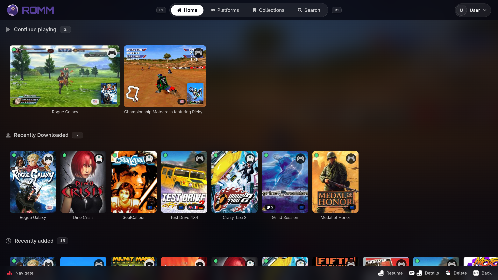

<div align="center">


# Ludo

**Sync ROMs, saves and states between RomM and RetroArch — and play them.**

[](LICENSE)



</div>

## What it is

Ludo is a client for a self-hosted RomM library. It browses that library, pulls
down what you want to play, keeps saves and states in sync in both directions,
and launches the game — without leaving the couch or touching a keyboard.

- **Library** — browse by platform, search, and see box art, screenshots and
  metadata straight from RomM.
- **Downloads** — queue and resume ROM downloads, extracting archives as needed.
- **Saves and states** — sync both ways with RomM, on a watchdog rather than a
  button. When two machines run Ludo, only one does the syncing.
- **Launch** — start a game in RetroArch, or in Eden for
  Switch titles, with core selection handled for you.
- **BIOS, cores and firmware** — fetch what a platform needs and report what is
  missing before it becomes a failed launch.
- **Gamepad-first** — the entire interface is built to be driven by a controller.

## Install

Grab either asset from the [latest release](https://github.com/Covin90/ludo/releases/latest).
Both are the same application at the same version; pick the one that matches how
you play.

**Steam Deck** — with [Decky Loader](https://github.com/SteamDeckHomebrew/decky-loader) installed, download
`Ludo-v<version>-decky.zip` and install it from Decky's plugin menu. Ludo then
lives in the Quick Access panel, in Game Mode.

**Linux PC** — download `Ludo-v<version>-x86_64.AppImage`, make it executable,
and run it. No install step, no daemon.

Either way, the first launch walks you through pairing with your RomM server
(scan a QR code, or type the address) and pointing Ludo at your RetroArch
directories.

Ludo updates itself in place from GitHub releases; you do not need to repeat
this.

## Building from source

You need Python 3.11+, Node.js 18+, and `pnpm` 9 for the Deck plugin.

```bash
git clone https://github.com/Covin90/ludo.git && cd ludo

# The shared Python side, installed editable
python3 -m venv .venv
.venv/bin/pip install -e engine          # not on PyPI, so install it first
.venv/bin/pip install -e 'app[test]'     # the editable engine above satisfies it
```

Then build whichever shell you want — `cd desktop && npm install && npm run electron`
for a PC window, or `cd decky_plugin && pnpm i && pnpm run build` for the Deck
plugin. Each shell's README covers dev servers, hot reload and packaging.

## Tests

```bash
cd app     && pytest          # backend and host-profile tests
cd engine  && tests/run.sh    # sync engine (builds its own venv if needed)
cd desktop && npm test        # the host-contract seam, and every route rendered
                              # in headless Chromium against a fake backend
```

## Releasing

One tag produces both assets, always at the same version — see
[RELEASING.md](RELEASING.md), which explains why that is enforced rather than
merely agreed.

## License

[GPL-3.0](LICENSE). Ludo bundles third-party binaries — `libsigil.so` (MPL-2.0)
and `7zz` (7-Zip License) — each documented, with source and hashes, in the
`bin/README.md` beside it.

## Trademarks

Ludo is an independent project, not affiliated with or endorsed by Nintendo,
Valve, Sony, Microsoft, Sega, or any other hardware or software vendor. Console,
platform and emulator names appear only to describe what Ludo works with. All
trademarks belong to their respective owners.

Ludo ships no games, no BIOS files, no firmware and no keys — it moves content
you already have, between your own RomM server and your own machine.
